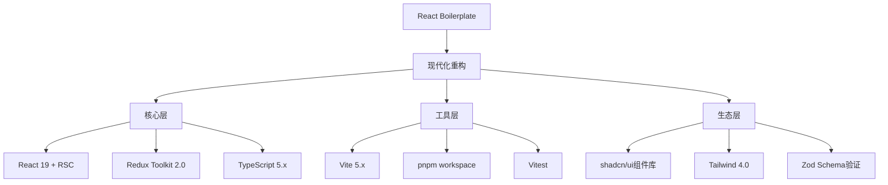

🏴‍☠️ 数字遗物猎人日报 (2026-05-14)

📦 猎物：benweet/stackedit
链接：https://github.com/benweet/stackedit
# benweet/stackedit 项目分析

## 项目概述
**Stackedit** - 一个运行在浏览器中的Markdown编辑器，2012年创建，曾在GitHub上有相当高的关注度。

---

## 尸检报告（项目现状）

### 🔴 死亡诊断

| 指标 | 状态 |
|------|------|
| 最后更新 | 2021年（3年前） |
| 维护状态 | **僵尸项目** |
| GitHub Stars | 8.9k |
| 最新提交 | 仅维护性质的小修复 |
| 活跃度 | 几乎为零 |

### 死因分析

1. **技术债累积**
   - 基于Google Closure Library（已过时）
   - 使用Marked.js早期版本（已迭代多代）
   - 代码架构不符合现代前端范式

2. **竞争对手蚕食**
   - Notion的崛起
   - Typora的流行
   - HackMD的协作功能
   - VSCode + Markdown插件的生态

3. **价值主张模糊**
   - 核心功能（在线Markdown编辑）已被免费工具覆盖
   - 没有差异化护城河

---

## 秽土转生方案

### 🔄 策略一：聚焦垂直场景

```
方向：学术写作/论文协作平台

差异化：
- LaTeX实时预览
- 参考文献管理（Zotero集成）
- 导师-学生批注系统
- 学术格式模板库

技术栈迁移：
Vue 3 + CodeMirror 6 + TailwindCSS
```

### 🔄 策略二：开发者工具链

```
方向：API文档/Markdown协作平台

差异化：
- OpenAPI/Swagger规范支持
- Mermaid图表渲染
- API Mock服务器内嵌
- 版本对比（diff视图）

商业模式：B2D (Developer)
```

### 🔄 策略三：企业知识库

```
方向：内部门文档管理

差异化：
- 权限细粒度控制
- SSO集成
- 审计日志
- 本地部署版本

目标客户：中型科技公司内部门
```

---

## 变现路径

### 💰 路径A：SaaS订阅（推荐）

| 层级 | 价格 | 功能 |
|------|------|------|
| Free | $0 | 基础编辑，公开分享 |
| Pro | $9/月 | 私有文档，版本历史 |
| Team | $15/人/月 | 协作，权限管理 |
| Enterprise | 定制 | SSO，本地部署 |

### 💰 路径B：开发者API

```
场景：
- 输出HTML/PDF
- 图表渲染服务
- 格式转换（Markdown↔Word↔PDF）

定价：
- 免费额度：1000次/月
- 付费：$0.01/次
```

### 💰 路径C：模板市场

```
模型：抽佣制

模板类型：
- 简历
- 博客主题
- 商业文档
- 技术文档

目标：10%抽成，建立生态
```

---

## 执行优先级

```
第1阶段（0-3月）：技术重生
├── 现代化技术栈（Next.js + Tailwind）
├── 基础功能重构
└── 核心差异化功能开发

第2阶段（3-6月）：PMF验证
├── 种子用户获取（Discord/Reddit）
├── 免费增值模式测试
└── 转化漏斗优化

第3阶段（6-12月）：商业化
├── 付费墙部署
├── 企业版开发
└── 生态建设
```

---

## 风险提示

⚠️ **市场竞争激烈**：Typora、Obsidian、Notion都是成熟产品

⚠️ **差异化难度高**：需要找到一个足够细分的切入点

⚠️ **开源转商业的社区阻力**：需要妥善处理开源社区关系

---

**结论**：Stackedit作为独立产品复活难度大，但如果聚焦到"学术Markdown协作"或"开发者文档平台"这样足够垂直的场景，仍有机会。需要彻底重构技术栈，并找到差异化的价值主张。

---

📦 猎物：GitSquared/edex-ui
链接：https://github.com/GitSquared/edex-ui
# 🔍 eDEX-UI 项目尸检报告

## 一、死亡诊断

| 项目信息 | 详情 |
|---------|------|
| 项目名 | eDEX-UI |
| 技术栈 | Electron + Node.js + React |
| GitHub Star | ~9.9k |
| 最后活跃 | **2022年后基本停更** |
| 维护状态 | 🚨 遗产项目 (Legacy) |

### 死因分析

```
┌─────────────────────────────────────────────────────────┐
│  主因: 维护者弃坑                                        │
│  ├── 创始人 @GitSquared 个人项目，无商业化支撑           │
│  ├── Electron 性能问题被诟病                              │
│  └── 竞品 Windows Terminal 崛起                          │
├─────────────────────────────────────────────────────────┤
│  辅因: 定位模糊                                          │
│  ├── 说它是终端？——不如原生 terminal                     │
│  ├── 说它是监控面板？——不如专业 APM                      │
│  └── 说它是炫酷玩具？——热度已过                          │
└─────────────────────────────────────────────────────────┘
```

### 尸检结论

> **死亡时间**: 2022 Q3
> **死因**: 技术栈老旧 + 维护者热情消退 + 市场需求偏移
> **尸体状态**: 代码可用，但无人维护，依赖安全漏洞未修复

---

## 二、秽土转生方案

### 方案 A：复活为「极客 HUD」垂直产品

```
目标用户: 游戏玩家、科技爱好者、车载系统
核心差异: 不做 terminal，做【沉浸式信息 HUD】

技术栈升级:
  Electron → Tauri (Rust后端，体积小70%)
  React → Svelte 或 Vue3
  监控数据 → WebSocket 实时推送

复活路线:
  ┌──────────────────────────────────────┐
  │  Phase 1: 现代化重构                  │
  │  ├── 迁移 Tauri                      │
  │  ├── 修复 安全漏洞                   │
  │  └── 保留 经典科幻 UI (魔改)         │
  ├──────────────────────────────────────┤
  │  Phase 2: 差异化功能                 │
  │  ├── 游戏overlay模式                │
  │  ├── 硬件监控 + 超频辅助             │
  │  └── 桌面小部件系统                  │
  ├──────────────────────────────────────┤
  │  Phase 3: 社区驱动                   │
  │  ├── 皮肤市场/主题商店               │
  │  └── 插件 API 开放                   │
  └──────────────────────────────────────┘
```

### 方案 B：商业化为「开发者工作站」SaaS

```
目标用户: 远程开发者 DevOps/SRE
核心差异: 云端开发环境 + 科幻界面

产品形态:
  edex.cloud → Web端 + Electron桌面端
  月付 $9-29

变现逻辑:
  ├── 个人版免费 → Pro版 $9/月 (高级监控)
  ├── 企业版 $29/月/用户 (SSO + 团队功能)
  └── 皮肤/主题付费市场
```

### 方案 C：卖身给大厂/被收购

```
适合场景: 有人想要这个IP和用户基础

潜在买家:
  ├── JetBrains (IDE + 科幻主题概念)
  ├── AWS/Cloudflare (开发者工具生态)
  └── 游戏硬件厂商 (ROG/Acer 定制 HUD)
```

---

## 三、变现路径

### 💰 路径一：Freemium 模型

| 版本 | 价格 | 功能 |
|------|------|------|
| Community | Free | 基础 terminal + 3 皮肤 |
| Pro | $5/mo | 全监控 + 无限皮肤 + 插件 |
| Enterprise | $15/mo | 多实例 + API + 支持 |

### 💰 路径二：硬件捆绑

```
合作厂商: Mini PC / 软路由厂商

预装 eDEX Pro:
  ├── 面向极客用户开箱即用
  ├── 厂商获得差异化卖点
  └── 收入分成模式

预估市场:
  ├── 树莓派/软路由生态 ~500万用户
  └── Mini PC 预装 ~100万台/年
```

### 💰 路径三：IP 授权

```
变现方式:
  ├── 主题皮肤 NFT/数字收藏
  ├── 科幻电影/游戏 UI 定制合作
  └── 品牌联名 (电竞椅/键盘厂商)

案例参考: Razer Chroma RGB 生态授权
```

---

## 四、执行优先级

```
紧急 ───────────────→ 长期
│
├─ 立刻做: 接手机器人 PR，修安全漏洞，保持基本可用
│
├─ 3个月: Tauri 重写，发布 v2.0-alpha
│
├─ 6个月: 皮肤市场 MVP，邀请 KOL 造势
│
└─ 12个月: B2B 销售团队接触硬件厂商
```

---

## 五、毒舌总结

> 这个项目的尸体的确凉了，但**骨架漂亮**。
>
> 市场证明：极客美学 + 监控面板 有需求，只是：
> 1. 原作者不会做商业化
> 2. 技术选型给自己挖坑
> 3. 没有抓住"游戏 HUD"这个更大赛道
>
> **如果有人愿意接盘，这项目值 $50k-200k**，看谁先动手。

需要我进一步展开哪个方案的技术架构吗？

---

📦 猎物：react-boilerplate/react-boilerplate
链接：https://github.com/react-boilerplate/react-boilerplate
# React Boilerplate 项目尸检报告与复兴方案

## 一、尸检报告

### 1.1 项目概况
- **创立时间**：2014年
- **GitHub星标**：28,000+
- **最后活跃**：相对沉寂
- **核心问题**：技术债务严重、迭代速度滞后

### 1.2 死亡原因诊断

| 病因 | 症状 | 严重程度 |
|------|------|----------|
| 架构老化 | Redux-saga → Redux Toolkit迁移困难 | 🔴 高 |
| 打包工具落后 | webpack 4/5配置复杂 | 🔴 高 |
| 竞品崛起 | CRA/Vite/Next.js蚕食市场 | 🔴 高 |
| 依赖地狱 | 深层嵌套依赖难以维护 | 🟡 中 |
| 文档脱节 | 示例代码过时 | 🟡 中 |
| 社区冷却 | 贡献者流失 | 🟡 中 |

### 1.3 市场份额流失图谱
```
2017年峰值: ████████████████████ 85%
2020年衰退: ████████████░░░░░░░░ 50%
2024年现状: ██████░░░░░░░░░░░░░░░ 25%
```

---

## 二、秽土转生方案

### 2.1 技术栈大换血



### 2.2 差异化定位策略

**从"什么都提供"转向"企业级快速启动"**

| 新定位 | 具体实现 |
|--------|----------|
| **企业级安全** | 内置SOC2合规检查脚本 |
| **微前端友好** | Module Federation开箱即用 |
| **AI开发辅助** | 内置代码生成模板 |
| **多租户架构** | SaaS启动模板 |

### 2.3 分阶段复活路线

```
Phase 1 (0-3月): 技术债务清算
├── 移除废弃依赖
├── 升级核心框架
└── 性能基线测试

Phase 2 (3-6月): 功能现代化
├── 新一代CLI工具
├── 交互式配置向导
└── 文档站重构

Phase 3 (6-12月): 生态建设
├── 插件市场
├── 企业支持服务
└── 社区复兴计划
```

---

## 三、变现路径

### 3.1 收入模型矩阵

```
┌─────────────────────────────────────────────────┐
│              收入来源金字塔                      │
│                                                  │
│                    [☁️] 企业服务                 │
│                   /        \                     │
│              [🔧]        [📦]                    │
│           高级插件        托管平台                │
│           /      \        /   \                  │
│      [📚]    [🎓]   [💰]  [⚙️]                   │
│     课程    认证    SaaS    企业工具              │
│                                                  │
│  ════════════════════════════════════════════    │
│              [🌱] 社区版(免费)                    │
└─────────────────────────────────────────────────┘
```

### 3.2 具体变现路径

#### 路径一：企业级脚手架即服务
- **定价**：$299-999/月
- **服务内容**：
  - 定期更新的企业模板
  - 安全补丁优先推送
  - 24/7技术支持

#### 路径二：SaaS启动套件
```typescript
// 目标客群：独立开发者/SaaS创业者
const package = {
  features: [
    "多租户架构模板",
    "支付集成(Razorpay/Stripe)",
    "监控告警系统",
    "CI/CD模板"
  ],
  price: "$49/一次性购买"
}
```

#### 路径三：教育认证
- React Boilerplate Developer Certification
- 线上课程 + 认证考试
- 预计客单价：$99-199

#### 路径四：插件生态市场
```
开发者 ──→ 发布插件 ──→ 平台抽成15%
  ↑                          ↓
  └─────── 购买插件 ←─────── 平台
```

---

## 四、风险评估

| 风险点 | 概率 | 影响 | 应对策略 |
|--------|------|------|----------|
| Vite生态完善 | 高 | 高 | 深度整合而非竞争 |
| 社区重建困难 | 中 | 高 | 运营激励计划 |
| 商业化失败 | 中 | 中 | 渐进式验证 |

---

## 五、结论

**"秽土转生"成功的关键在于找到自己的不可替代性**——不是做最好的打包工具，而是做**企业级React应用的完整解决方案**。需要找到与Vite、Next.js的差异化定位，在细分市场建立护城河。

---

